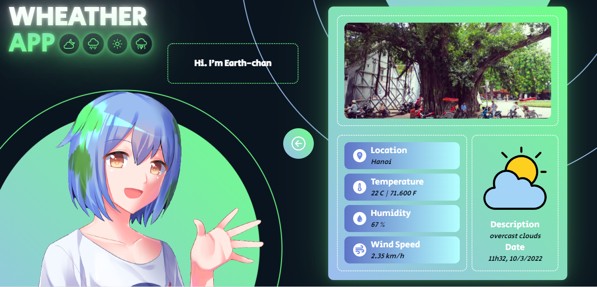
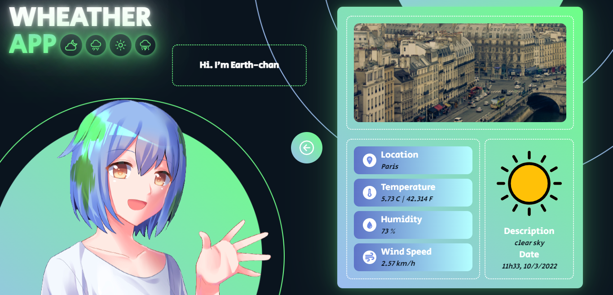
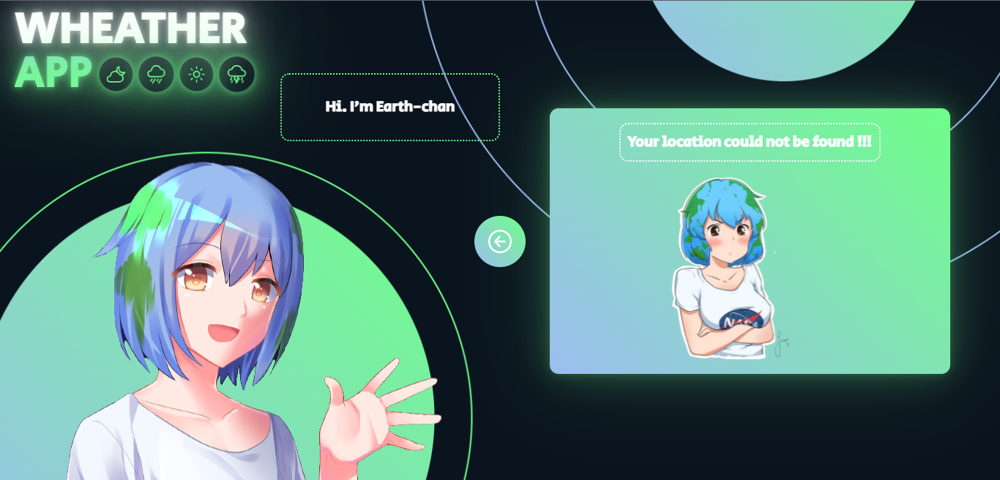

# Find Github User
## Deploy
>https://amazing-brahmagupta-41d12b.netlify.app/
## Endpoint
>`https://api.openweathermap.org/data/2.5/weather?q=${city}&units=metric&appid=${APIkey}`

## Get Image
- Ex: https://api.github.com/users/PrimeRogue/repos?sort=created
>`https://source.unsplash.com/1600x900/?${data.name}`

## Demo

